# Samurai — a third-person Three.js template

A complete third-person action stage in the browser: a rigged samurai on an
endless procedural night landscape, with locomotion, motion-warped melee,
summons, flight, ragdoll deaths and an equipment studio to dress the body in.

No engine, no physics library, no asset pipeline. Three.js, Vite, and one file
of settings that everything reads every frame.

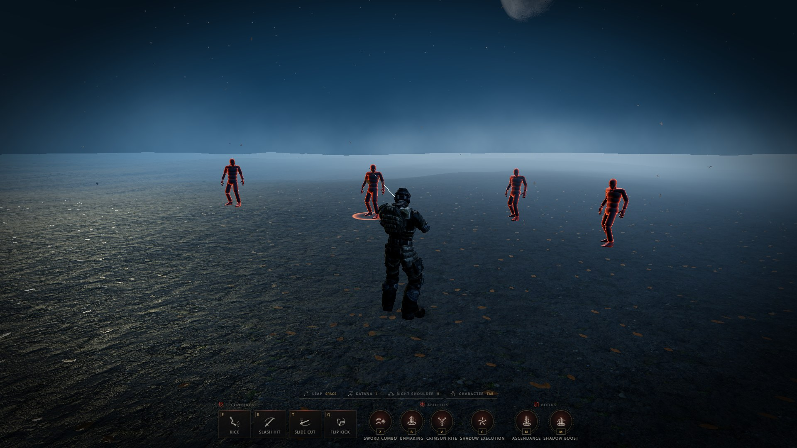

```bash
npm install
npm run dev      # http://127.0.0.1:5173
npm run build
```

## Controls

| | |
| --- | --- |
| `WASD` / arrows | Move. `Shift` runs. |
| `Space` | Leap — a running long jump, or an in-place hop at any lesser pace. In the air it looses the blades. |
| `E` · `R` · `T` · `Q` | Kick · Slash Hit · Slide Cut · Flip Kick. |
| `Z` | Sword Combo — throws two cuts across the ground at a body up to eleven metres off, then closes and takes it apart. |
| `V` | Shadows — mark two bodies, and a shadow of you goes for each. |
| `C` | Judgement — mark one body, and a fist comes down through a seal over its head. |
| `B` | Unmaking — strikes twice at the nearest body: a rune into the ground under it, then a column of void up through it. Nothing is left to fall. |
| `X` | Flight — leave the ground, mark bodies to forge a blade for each, `Space` looses them. |
| `1` | Swap the weapon. The katana burns away and the rifle burns in, or the other way round. |
| `Tab` | The equipment studio. |
| click · mouse | Take the pointer, then move the mouse to turn the view. |
| `Esc` | Give the cursor back, for the editor and the panels. Clicking the canvas takes it again. |
| wheel | Zoom. |
| `G` · `F` · `P` | Editor · frame stats · pause. |

The pointer is the stage's, not any one weapon's
([core/PointerLook.js](src/core/PointerLook.js)): a click captures it and the
mouse turns the view with a sword in hand, a rifle in hand or nothing at all,
and `Esc` is the one way back to a cursor from anywhere. The orbit drag is still
there while the cursor is free, so nothing is lost by pressing it. The one place
the pointer is never taken is the equipment studio, which is a room you point at
things in.

**With the rifle drawn**, the whole stage becomes a shooter — the lens steps
onto a shoulder, a reticle comes up, and the torso points at whatever it is on.

| | |
| --- | --- |
| hold left | Fire. Three rounds in the body or one in the head puts someone down. |
| hold right | Down the sights — closer, narrower, and far more accurate. The view slows with them. |
| `H` · middle click | Cross the lens to the other shoulder. |

The moves are also drawn along the bottom of the screen, one panel per kind,
and every one of them is a line in [src/config/abilities.js](src/config/abilities.js) —
rebinding a key, renaming a move or adding one is an edit to that file and
nothing else. `core/Input.js` builds its key map from it, `ui/ActionHUD.js`
draws the panels from it, and `core/App.js` resolves a state per `id` each
frame.

---

## The world

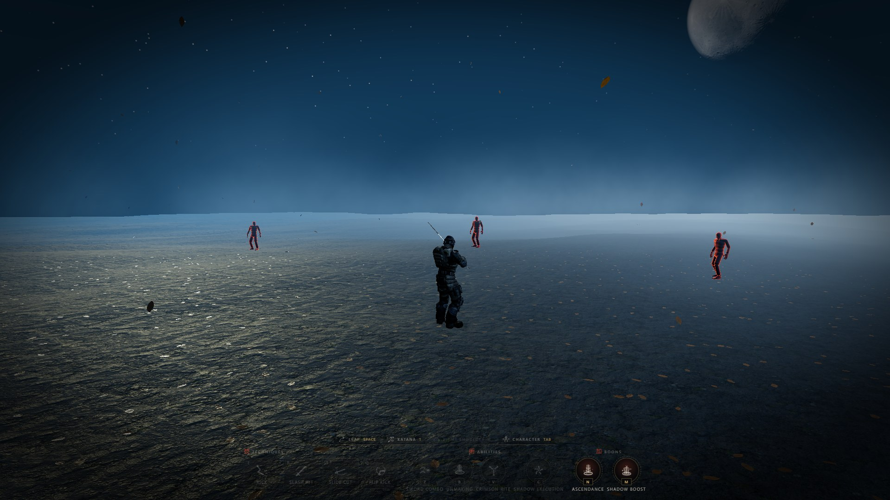

One height field, one sky, one body of air, and nothing on screen is allowed to
disagree with any of them.

| System | File | Notes |
| --- | --- | --- |
| Terrain | [src/world/Terrain.js](src/world/Terrain.js) | The world's height field, and the only thing allowed to answer "how high is the ground here". Table-driven value noise, evaluated identically on the GPU (the floor, the litter) and in JS (the character, the camera, the shadow focus). Every knob is a live uniform. |
| Floor | [src/world/Ground.js](src/world/Ground.js) | A grid that follows the character and is displaced up the height field in its vertex shader, so there is no world edge to walk off. The tiling is world-locked through the texture offset and everything the shader does is a function of world position, so only the light pool travels. |
| Sky | [src/world/Sky.js](src/world/Sky.js) | One fullscreen shader: a gradient whose horizon *is* the haze colour, a cell-hashed star field, and a moon. It **owns where the moon is** — `sky.moon.azimuth/elevation` resolve into `frame.uLightDir`, so the disc, the glare, the haze's inscatter lobe and the ground mist's lit side can never disagree. |
| Moon | [src/world/Moon.js](src/world/Moon.js) | The moon as a body rather than a dot product. A sphere carrying a real lunar surface material, projected **triplanar in object space** — the maps are 1024² squares of ground, so wrapping them on sphere UVs would seam the face and pinch every crater into the poles. The relief is *geometry*: the height map displaces vertices, so crater rims break the silhouette instead of being shaded onto a circle. `Sky` stands its own disc down whenever this one is up. |
| Air | [src/world/Atmosphere.js](src/world/Atmosphere.js) | What replaces three's linear fog: an analytic height-fog integral with a moonlit forward lobe, so haze pools in the hollows and glows looking into the moon. One `exp` per fragment more than a linear fog. |
| Ground fog | [src/world/GroundFog.js](src/world/GroundFog.js) | Soft billboard puffs carried downwind, spreading as they age, reading the floor's own baked height field so they hug the ground and dissolve into it. The whole trajectory is closed-form in the vertex shader — the CPU only writes the handful of slots that expired this frame. |
| Leaves | [src/world/Leaves.js](src/world/Leaves.js) | Two populations, one look: 5 600 leaves lying on the floor ([LeafLitter](src/world/LeafLitter.js)) and 260 in the air ([LeafDrift](src/world/LeafDrift.js)), off one sheet of nine leaves with one grade, one backlight and one wind. Drawn opaque and **alpha-tested** rather than blended — they write depth, need no sorting, and can be drawn in any order, which is the only reason they cost one draw call each. Walking through the litter scatters it: the body's position and its ground velocity go in raw, so a sprint throws leaves and standing still disturbs nothing. |
| Lighting | [src/world/Environment.js](src/world/Environment.js) | One cool key with a 4096² shadow map re-centred on the character, a cool rim behind it, a deep blue sky fill and a pale bounce off the ground. The key and the rim light **the character only**: three has no per-object light filtering, so the world's own surfaces are patched to drop every directional light instead. The HDR probe is kept only as a dim specular response and is never the visible sky. |
| Contact shadows | [src/world/ContactShadows.js](src/world/ContactShadows.js) | The tight darkening under the feet the sun's shadow map cannot resolve. |
| Camera | [src/core/CameraRig.js](src/core/CameraRig.js) | Orbit rig whose distance always resolves back to `settings.camera.distance`, so the wheel and the settings file never disagree. |
| Pointer | [src/core/PointerLook.js](src/core/PointerLook.js) | Captures the mouse for the whole stage and turns its deltas into view; `Esc` hands the cursor back and stands the orbit drag up in its place. |
| Post | [src/postprocessing/PostProcessing.js](src/postprocessing/PostProcessing.js) | Bloom → tone map → one grade pass (aberration, contrast/saturation/temperature, vignette, grain). |

### The terrain, and why the noise is a table

`terrainHeightAt(vec2)` in
[src/shaders/lib/terrain.glsl.js](src/shaders/lib/terrain.glsl.js) is the world's
surface. The floor mesh is displaced by it in its vertex shader, the leaf litter
lies on it, and [src/world/Terrain.js](src/world/Terrain.js) mirrors the same
arithmetic in JS so the character, the camera anchor, the contact shadow and the
sun's shadow focus all stand on exactly the ground you can see.

That mirroring is why the noise is **table-driven** rather than the usual
`snoise`. A procedural hash (`fract(sin(...) * 43758.5)`) does not evaluate
identically on a GPU and in JS — it agrees to a few decimals, which is
centimetres of terrain, which is a character sinking into a hill. A 256×256 byte
table sampled with `NEAREST` returns exactly `byte / 255` on both sides, and
everything downstream of it is plain float maths that lands within a micrometre.

Two things then have to be handled or the ground boils:

- **Swimming.** The floor plane follows the character, so a vertex's world
  position — and therefore its height — would change under it every frame.
  `Ground#setCenter` snaps the plane to whole vertex spacings, so every vertex
  keeps landing on the same world positions and the mesh slides beneath a
  surface that never moves.
- **Normals.** Taken analytically from the field by central difference, over
  exactly half the vertex spacing, so the shading never claims detail the
  triangles cannot show. The tiling's own normal map rides on top.

Everything in `settings.terrain` is a live uniform, so the landscape can be
redialled while walking over it:

| `amplitude: 0` | `amplitude: 3.4` (shipped) | `amplitude: 15, ridge: 0.85` |
| --- | --- | --- |
| 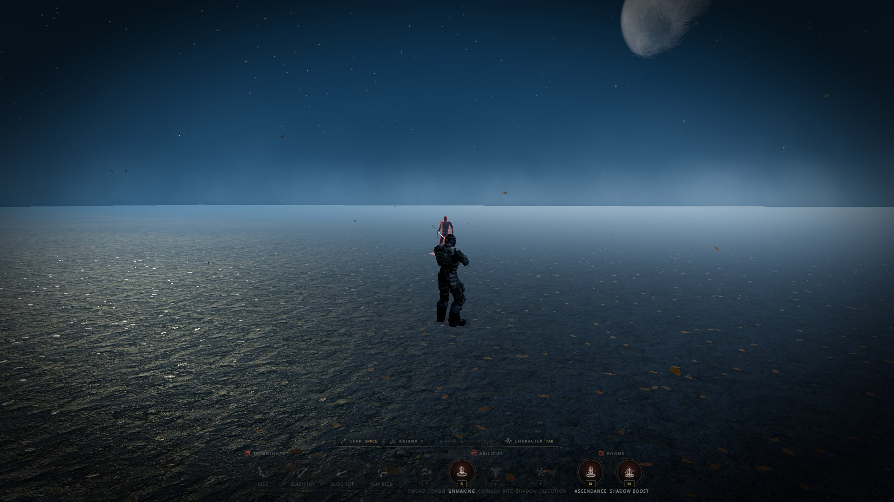 | 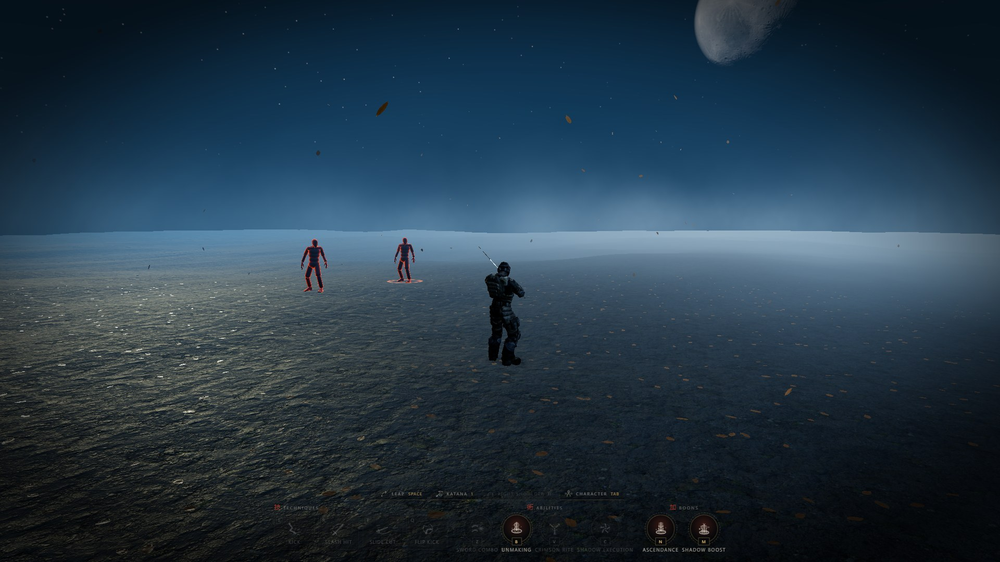 | 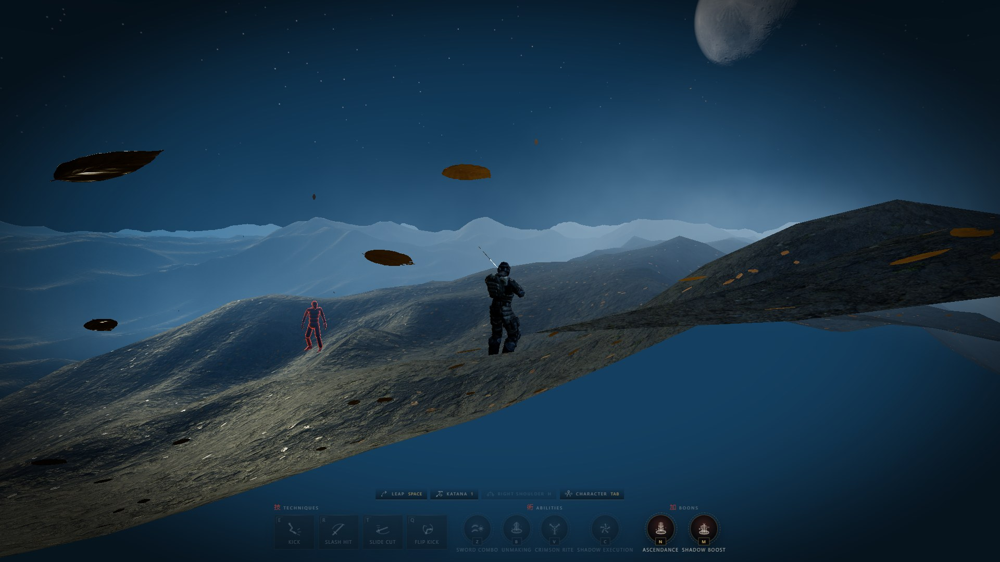 |

The two exceptions are `seed` (reshuffles the table) and `segments` (rebuilds the
floor grid). `octaves` is the real cost dial. Amplitude 0 collapses the whole
thing back to a flat plane at y = 0, for free.

---

## The character

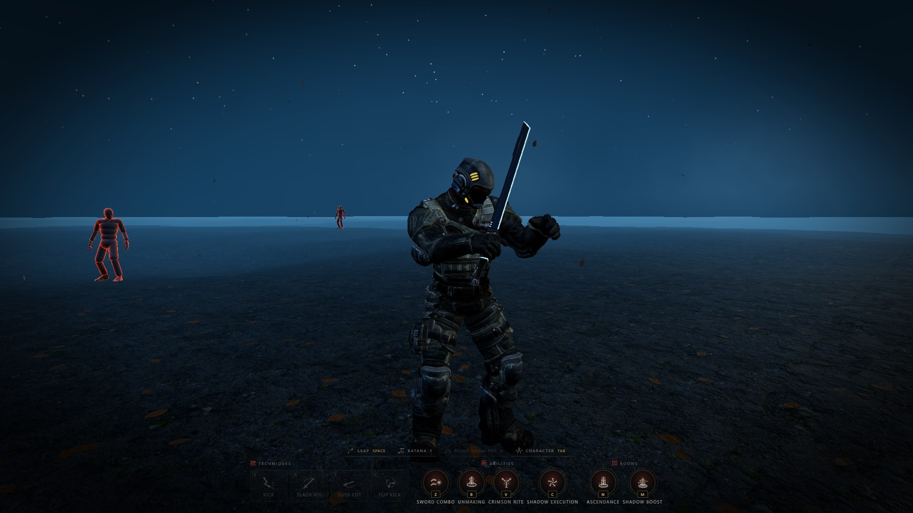

The body and its motion live in different files.

`public/models/tpose.fbx` is the skin: one textured, skinned mesh rigged to
Mixamo's `mixamorig:` skeleton, in a T-pose with no animation of its own.
[CharacterController](src/animation/CharacterController.js) normalises it to
`settings.character.targetHeight`, converts its materials to PBR and keeps
whatever maps and colours the export carries.

`public/animations/*.fbx` are skeleton-only exports — joints, no mesh. Because
both files name their joints identically, `_retarget()` lifts the first clip out
of each and binds it to the body, dropping tracks for joints this rig does not
have. Two corrections happen on the way:

- **Units.** Translation tracks are rescaled by the ratio the two bind poses
  imply, measured off the hips, so a body exported in metres takes a clip
  authored in centimetres without launching into the sky. Rotations need none.
- **Root motion.** The controller owns where the body is, so the hips'
  horizontal travel is frozen at its first frame and the clip plays in place.
  The vertical is kept — that is the gait's bob, not travel. A clip named in
  `ROOT_MOTION_CLIPS` has that horizontal travel *recorded* on the way past
  instead of merely dropped, so something else can replay it onto the root.

Adding a state is one line in `ANIMATION_URLS` plus a weight in `Locomotion`.

### Moving

[ThirdPersonController](src/animation/ThirdPersonController.js) integrates the
input into a velocity rather than applying it as a position delta, and turns the
body toward where it is *going* rather than where the camera looks.
[Locomotion](src/animation/Locomotion.js) reads that one speed and blends
idle → walk → run from it. All three clips play permanently and only their
weights move, so a stop-start input can never catch the body between fades; walk
is the master gait and run is slaved to its normalised phase, which is what
stops the mid-blend shuffle. Playback rate is the body's real speed divided by
the speed the clips themselves cover, so raising `walkSpeed` or `runSpeed` turns
the legs over faster to match instead of skating them.

`Space` from a run — never from a walk, never from standing — commits the body to
[Jump](src/animation/Jump.js). It is a committed move: the stick is dead from
launch until the feet are down, and the arc's own travel is what carries the
character. `settings.jump.distance` renormalises that travel to an exact reach in
metres. At any lesser pace the same class plays the in-place hop from
`settings.hop`, which never takes the controls — `gaitBleed` is how much of the
walk or run keeps playing underneath, because taking the whole standing-jump pose
would plant the legs while the body travels on.

---

## Fighting

### Who a press would land on

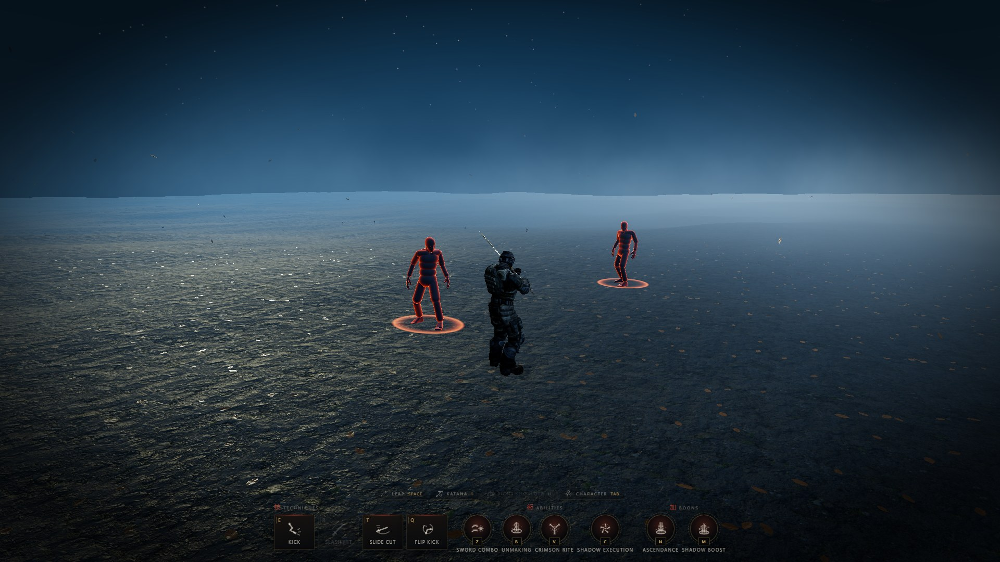

A body wears a ring because a key would take it — not because it happens to be
standing inside some cone alongside three others the swing will never reach. The
question is asked one move at a time, and it is that move's *own* question:
`findTarget` with its range and its cone, which is the exact call
`ThirdPersonController` makes on the press. Two rings can come up at once, and
when they do they are telling the truth: the kick and the slash have locked
different bodies, and the caps over each head say which key goes where.

One answer feeds three things — the cap over the head, the plate along the
bottom, and the press itself — so a plate can never light over a body no key
would reach.

### Aiming an animation that was authored for someone else

A kick is authored against an imaginary opponent at one exact distance and one
exact angle, and the player is never standing there. There are only three ways
out of that and two of them are wrong: sliding the body over with an ease reads
as skating, and letting the foot swing through air a foot short reads as a bug.
[Attack](src/animation/Attack.js) does the third — **motion warping**.

On the press the target is locked, the spot the clip needs (`standoff` metres
short of that body, facing it) is resolved once, and the character is carried
onto it *inside the clip's own approach* — turning first and stepping in second
(`turnAt`), because that is the order a person does it in. By `hitAt` the body is
exactly where the animator assumed it was, and the foot lands.

The class never writes a transform. Like `Jump` it only resolves where the body
*should* be, and `ThirdPersonController` — the one authority over position — puts
it there. Its clock is the action's own, so the whole move obeys
`animationSpeed`, the pause key and the hit-stop for free.

The kick (`E`), the slash (`R`) and the slide cut (`T`) are three instances of
that one class, differing only in the clip they were handed and the settings
block they read. A press with nothing in range still swings: an attack button
that does nothing feels broken, and a whiff is information.

### Contact

Three things happen on the same frame and all three are the same beat: the body
is handed to the ragdoll, the world drops to `hitStopScale` of its speed for
`hitStop` seconds, and the lens takes a `shake`. Any one alone reads as a glitch;
together they read as weight. The hit-stop is a scale on `dt` rather than a
pause, so the animation, the ragdoll and the mist all slow together — and the
shake runs on real time, so the lens keeps moving while the world holds still.

All three are read off the move that landed, which is the whole difference
between the attacks at the moment of impact: the kick's is a short flat shove,
the slash's a longer freeze and a body in two pieces.

### The ragdoll

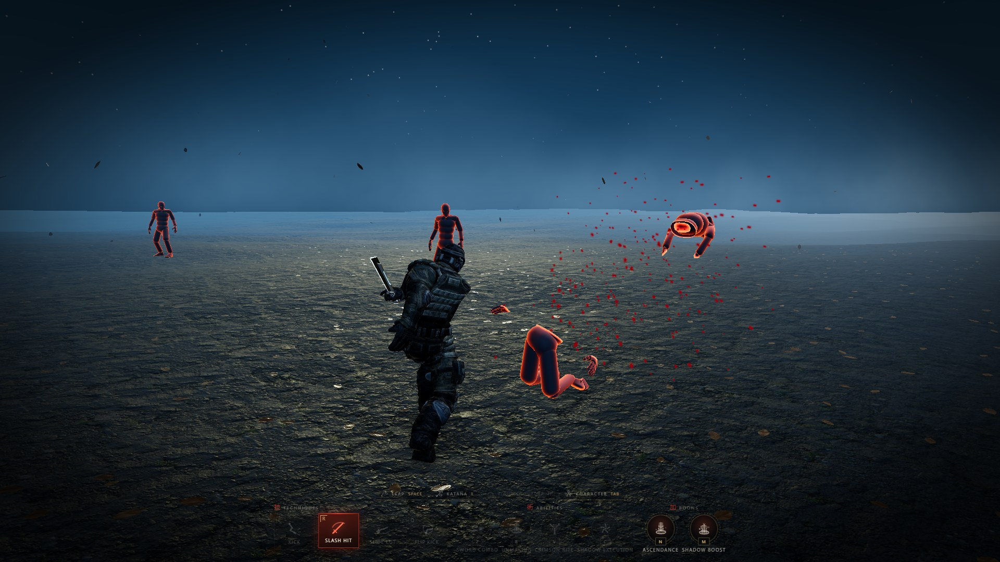

[Ragdoll](src/combat/Ragdoll.js) adds no physics engine, because a ragdoll does
not need one. What the eye reads as a body falling is bone lengths that never
change and limbs that cannot bend the wrong way, under gravity, with the ground
in the way — and all three of those are distance constraints. So the skeleton
becomes a particle per joint, the bones become constraints, and the whole thing
is relaxed a few times per substep. The solve is position-based rather than plain
Verlet: predict, project, then read the velocity back out of the correction,
which is the form that survives a hit-stop and a paused clock.

Three things stop it reading as a rope:

- **Mass.** The pelvis and chest are heavy, the hands and feet light, held as
  inverse mass. Corrections split in that ratio, so an arm whips off a torso
  that barely notices.
- **Bracing.** Bone lengths alone give a chain that folds flat. A dozen extra
  constraints across the pelvis, the chest and the spine give the body a shape it
  is trying to keep while everything else flails.
- **Limits.** A knee that bends both ways is the most recognisable tell there is,
  so the hip-to-ankle distance is floored and capped.

Getting points back onto a skeleton is the other half. Every bone is turned to
*aim* at its child's particle, which leaves the twist about its own axis exactly
as the death pose had it. The pelvis and the chest have two independent
directions available, so their full orientation is rebuilt from that frame
instead — without it, a body face-up and a body face-down are the same aim vector
and the corpse lands on its side every time.

The handover is not a blend. The mixer is stopped mid-frame and the solver's
first pose is whatever the clip was showing when the blow connected, which is the
only way a death looks like it happened to the same body that was standing there.

### The bodies

Five of them stand within `radius` of the player and no nearer than `minRadius`,
spread over the *area* of that ring rather than its radius, and rejected against
each other so no two share a patch of ground. One rig is downloaded and every
enemy is a `SkeletonUtils` clone of it, each idling on its own phase of the same
clip at its own slight pace — five bodies breathing in unison is the most
artificial thing a crowd can do.

A corpse does not hold a slot: the refill timer starts when the body dies, so the
ring is back to full while the old one is still lying there. It stays for
`corpseTime`, then burns away over `dissolveTime` on a noise dissolve that rises
from the feet — `discard` rather than alpha, so a body lying inside a bank of
ground mist never has to be sorted against it.

The export carries no textures at all, so the look is authored rather than
imported: a cold near-black body with an ember fresnel rim, which is the one
combination that stays legible against a blue night at twenty metres.

---

## The three abilities

All three are **aimed by marking a body first**, and the aim
([TargetMarking](src/combat/TargetMarking.js)) is the same machine each time on
its own block of settings. It is screen space, not world space, and that is the
whole of it: a body is a candidate when it is near the point on screen the player
is aiming at, and the nearest wins. The tolerance is a fraction of the screen's
*height*, so this is a look rather than a pixel hunt.

The aim point is the middle of the screen while the pointer is captured, which
on the play stage it ordinarily is — the mouse turns the view rather than moving
a cursor across it, so marking is looking at someone and clicking. With the
cursor free it is the cursor instead, and the two are the same gesture rather
than two: before it has moved it is already in the middle of the frame.

### Shadows — `V`

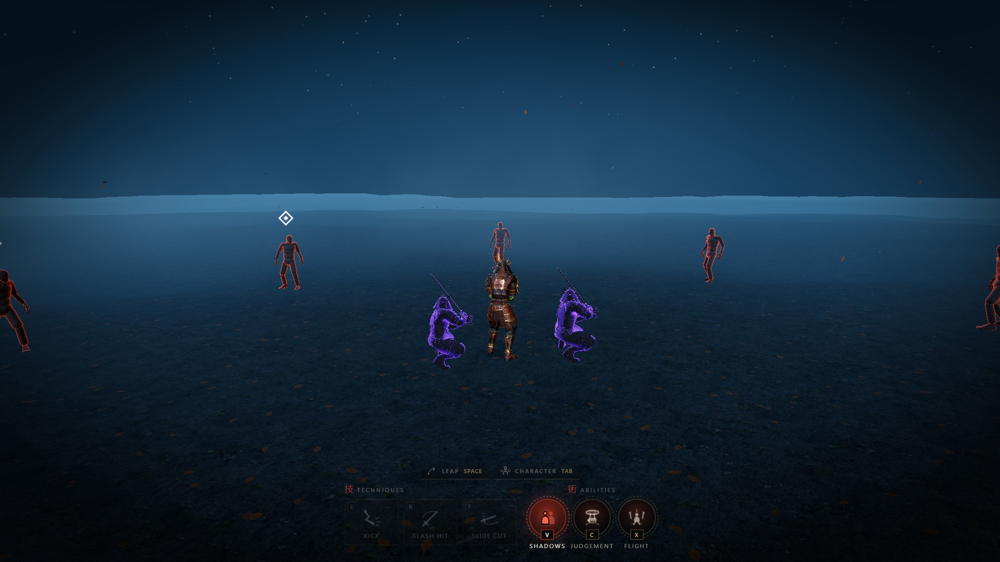

Two clones of the rig — body, armour, weapon, everything hanging off a bone — with
every material replaced by one black surface. Same silhouette, same frames: two
more of *you*, standing where you are not.

Each runs one errand and it is over. It is **born standing inside the character
in its exact pose** (every cloned node's local transform copied off the node it
was cloned from, so a turn or a gait blend lands on the shadow the same frame it
lands on the body) and slides out to a mark beside it; it **crouches** there for
a beat — the point of the whole summon is that two things step out of you, settle,
take their mark, and *only then* move; it **hunts** one body each, never the same
one twice; and it **strikes** with one of the player's own attacks, thrown with
that move's numbers, so a shadow's slide cut takes a body apart exactly as yours
does.

Deliberately not the same *beat*, though: no hit-stop, and half the shake.
Hit-stop is the player's own blow sold back to them, and freezing the world for a
cut thrown thirty metres away by something that is not you reads as a stutter.

### Judgement — `C`

| The seal opens | The fist comes through |
| --- | --- |
| 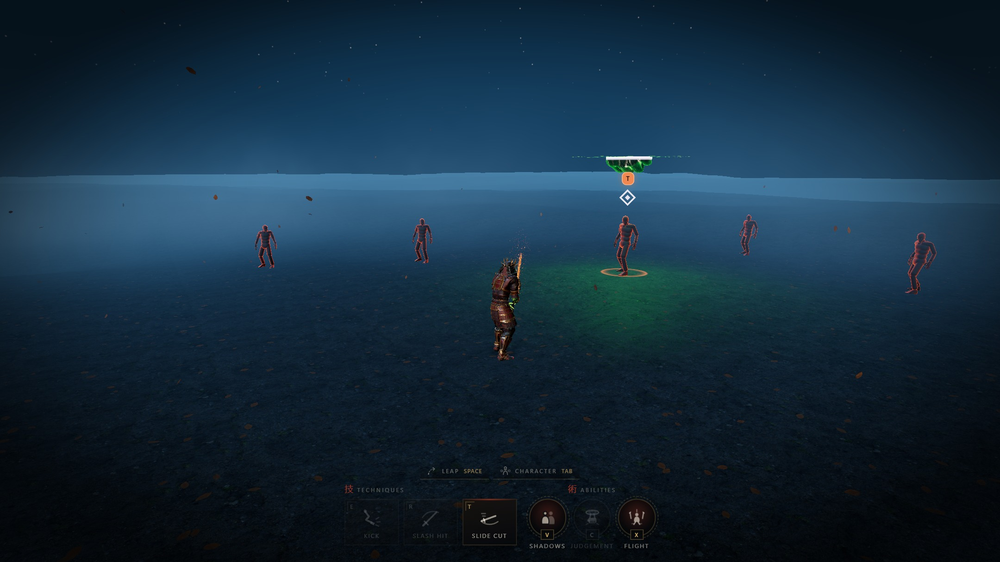 | 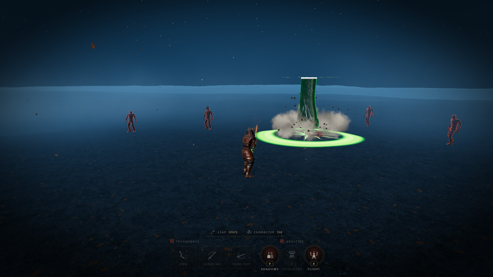 |

Six beats: the seal **writes itself** into the air over the mark, one full turn
anticlockwise from the top; it **charges**, held, tightening and brightening
while nothing else happens — the beat that makes the blow inevitable rather than
sudden, and without it the whole move reads as a projectile; the fist **falls**,
accelerating on `t²`, which is what a dropped thing actually does; it **lands**,
and everything happens on that one frame — the body is felled, the world nearly
stops, the lens is kicked, the ground opens and throws up what it is made of; it
**dwells**, sitting on the result, because the cheapest way to make a blow feel
heavy is to leave the thing that landed exactly where it stopped for half a
second; and it **withdraws** back up through the seal, which folds.

The trick the whole thing hangs on: a fist falling out of a circle is a prop
unless the circle is a **hole**. So the fist's material discards every fragment
above the seal's plane and burns a line where it crosses, and the forearm is
stretched in the vertex shader so it always reaches that plane however high the
seal was hung. What is on screen is never a floating arm — it is an arm coming
through something, at any height, at any point in the drop, with no keyframes
anywhere.

### Flight — `X`

| Marking from the air | The volley |
| --- | --- |
| 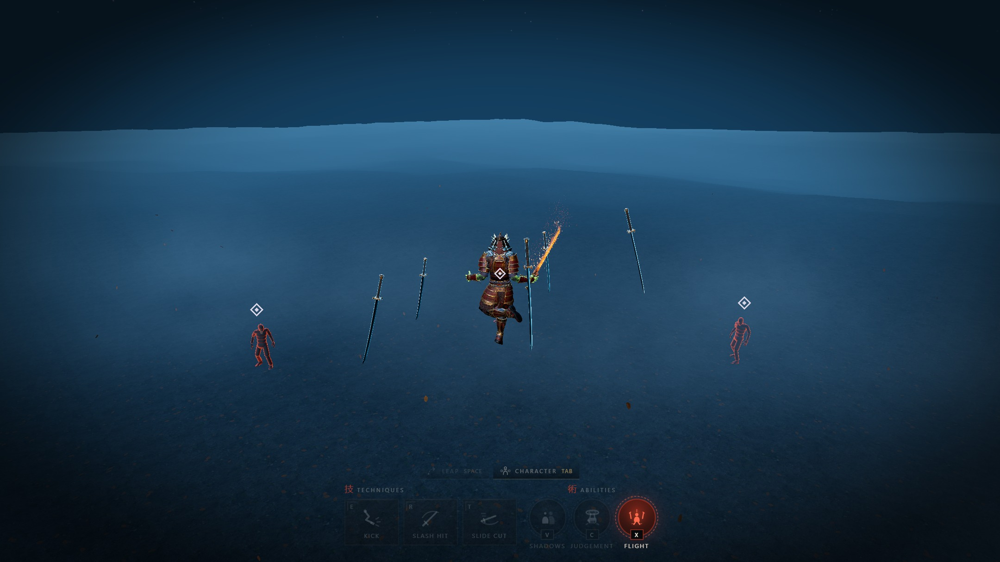 | 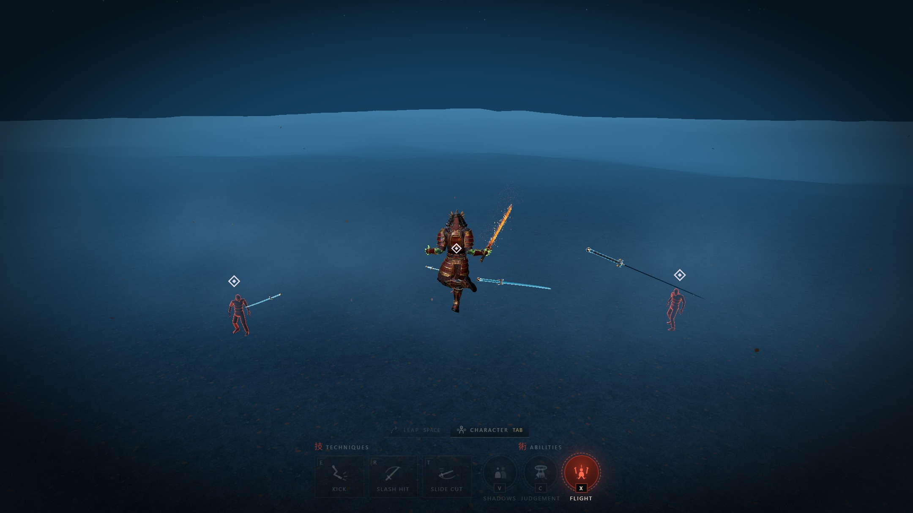 |

The one ability that is a **mode** rather than a move, and the one that excludes
the others. Taking off does three things at once, and they have to start together
or it reads as three events: the body leaves the ground, the aim comes up so the
very next click is a mark, and everything belonging to the ground is put away.

While you are up there, every body you click forges a blade — the character's own
katana, cloned out of whatever is actually equipped at that moment, wearing its
own material and maps. It is the same sword the samurai is holding: same steel,
same temper line, same wrap on the grip, lit by the same moon. What the summon
adds is a fresnel rim and the threshold that writes it into the air in the first
place. An object you recognise, with something happening to it, reads as *the
sword doing something*; a replacement material reads as a prop that happens to be
sword-shaped.

Each blade **forges** (a threshold sweeping up the model with a ragged, noisy
front — drawn rather than switched on), **holds** station in the turning halo and
charges, **winds** back away from its mark on the loose, **strikes** through the
body it was forged for, and **plants** itself in the ground behind the kill,
ringing like a struck tuning fork before it burns back down the way it was
written. They leave one at a time.

The aim here **re-arms itself on every click**, because in this mode marking is
what the player is *doing* rather than a mode they are in. `Space` looses;
landing looses whatever is still hanging rather than dropping it, because the
player marked those bodies and throwing the volley away on the way down would be
taking it back.

---

## The equipment studio — `Tab`


`Tab` moves the body out of the play scene and onto a set built for one thing:
looking at it and dressing it. It is a *mode*, not a scene-graph trick — entering
swaps the camera, the lighting and the grade, and hands the pointer to an
inspection orbit. Nothing is duplicated: the same skeleton, the same mixer and
the same equipment mounts are on screen in both places, which is what makes gear
tuned here already correct out in the world.

| Piece | File | Notes |
| --- | --- | --- |
| The set | [src/world/StudioStage.js](src/world/StudioStage.js) | Key light *twice* — a spot that carries the shadow and a rect-area softbox at the same angle that does the wrap and the specular roll — plus an area fill from the opposite quarter, a cool rim and a warm kicker behind each shoulder (deliberately unmatched: equal edges read as a mistake, differing ones read as a room), a hair light, and a cyclorama whose halo is placed from the view vector every frame so the silhouette is always framed against the bright part of the wall. |
| Camera | [src/screens/StudioCamera.js](src/screens/StudioCamera.js) | Free inspection orbit — drag to spin, wheel to dolly, right-drag to pan — plus framing presets that glide and abandon themselves the moment the pointer touches the canvas. |
| The mode | [src/screens/CharacterScreen.js](src/screens/CharacterScreen.js) | Owns the switch: which scene the post stack draws, which camera, which grade block, and which update path runs. |
| Panel | [src/ui/CharacterScreenUI.js](src/ui/CharacterScreenUI.js) | Plain DOM. Holds no state: every value is re-read from the manager, so the gizmo and the number boxes can never disagree. |

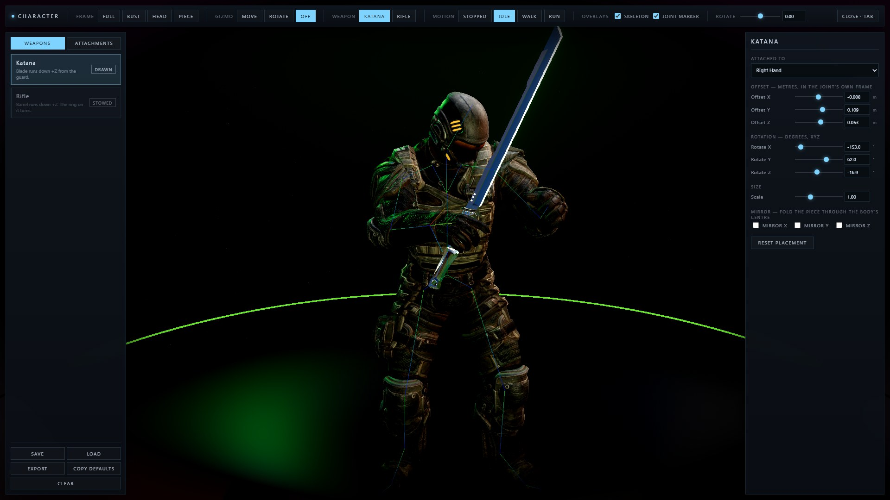

Tuning a placement: pick a category, click an item to equip it, then set the
joint and nudge the offset. The `Move`/`Rotate` gizmo in the viewport writes the
same numbers the inspector's sliders do — drag the arrow and the slider follows,
type in the box and the piece moves. `Skeleton` draws the rig through the armour,
the joint marker shows where a piece is anchored, and `Motion` plays the walk and
run so gear can be judged while the body moves.

When it looks right, **Copy defaults** puts the placements on the clipboard as a
snippet to paste over `defaults` in the catalog. **Save** keeps a loadout in
localStorage and **Export** writes it as JSON.

### The catalog is the whole content layer

Adding a sword is one entry in
[src/equipment/EquipmentCatalog.js](src/equipment/EquipmentCatalog.js) and no code
anywhere else:

```js
{
  id: 'sword',
  name: 'Katana',
  category: 'weapons',
  url: './models/weapons/sword.glb',
  defaults: { bone: 'RightHand', position: [-0.051, 0.102, 0.052], rotation: [-168.3, 84, -0.8], scale: 1 }
}
```

`weapons` and `attachments` are kept apart on purpose. Weapons is the category
that will grow rules — drawing and sheathing, a hand it has to be in, damage;
attachments are cosmetic and never will. Splitting them now makes that later work
a change to one category rather than a filter over a flat list.

Two things happen to a model on the way in:

- **It loads lazily.** Nothing downloads until something asks for it — the boot
  path is untouched by a catalog of any size. The rest is prefetched in the
  background once the screen is actually open.
- **It wears the body's materials.** Every one of these exports embeds the same
  four 1024² maps the character's palette already carries; they came out of one
  Blender scene. So the material is resolved against
  [MaterialLibrary](src/loaders/MaterialLibrary.js) by name and the export's own
  is released — zero extra texture memory, and gear lit by exactly the same
  material the armour is.

### Mounts, and why offsets are in metres

[EquipmentManager](src/equipment/EquipmentManager.js) parents each piece to a
*mount* rather than straight to the joint, and the mount's scale is the inverse of
the joint's world scale. The rig is a Mixamo FBX — authored in centimetres, scaled
by `fbxScale` and again to reach `targetHeight` — so a joint's world scale is
about 0.01, and an object parented straight to it would arrive a hundred times
too small with offsets to match. The mount cancels exactly that: everything inside
it is in metres, whatever the rig was exported at, and the numbers stay valid when
`targetHeight` moves.

Straight to a bone still works, for code that wants no placement of its own:

```js
app.character.attach(sword, 'RightHand');
const head = app.character.getBone('Head');
```

Bones are indexed under both their raw and namespace-stripped names, so ask for
the plain joint. Anything parented to one rides the skeleton for free.

---

## The editor — `G`

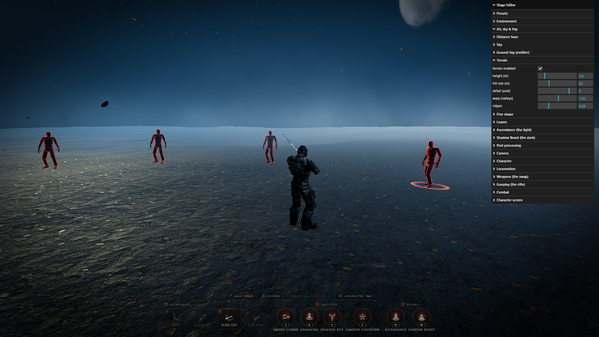

Every tweakable number in the project lives in
[src/config/settings.js](src/config/settings.js), and
[src/ui/Editor.js](src/ui/Editor.js) is a lil-gui panel bound straight to it.

No controller has an `onChange` handler, because none is needed: the lights, the
floor shader, the leaves, the rig and the post stack all *sample* those fields
every frame, so a slider re-lights the scene on the next one with no rebuild and
no shader recompile. That holds while the clock is paused (`P`), which is when a
pose is actually worth lighting.

Systems may only ever sample these values — never copy one into a record at
construction time and read it back later. That single rule is what the whole
live-editing story rests on.

Presets are snapshots of the whole tree in localStorage, exportable and importable
as JSON, with a reset to the shipped defaults. Loading merges *into* the live
objects rather than replacing them, so bindings held by a shader or a light stay
valid.

The same fields are on `window`, so the console works too:

```js
settings.terrain.amplitude = 14;                // mountains, walked on the same frame
settings.terrain.ridge = 1;                     // sharp crests instead of rolling downs
settings.terrain.amplitude = 0;                 // back to a flat plane, for free
settings.leaves.drift.count = 900;              // a gale of leaves
settings.environment.sunIntensity = 4;          // re-lights on the next frame
settings.environment.floorTextureSet = 'stone'; // swap the soil for flagstone
settings.global.timeScale = 0.25;               // bullet time, everything at once
settings.camera.distance = 8;                   // the rig glides out
```

And the app itself:

```js
app.toggleCharacterScreen();                    // same as pressing Tab
app.enemies.respawnAll();                       // a fresh ring of them
await app.characterScreen.equipment.equip('scabbard');
app.characterScreen.equipment.setBone('scabbard', 'Spine');
console.log(app.characterScreen.equipment.snippet());  // paste over the catalog defaults
```

## Frame stats — `F`

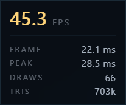

Frame rate, average and peak frame time, draw calls and triangles, averaged over a
half-second window. The counters are sampled at the top of the *next* frame, where
a frame ends for certain, rather than at each of the several places one can end.

The numbers above are a full stage — terrain, litter, drift, mist, five enemies
and the whole post chain — in about 66 draw calls.

---

## How it fits together

`core/App.js` builds every subsystem and then does nothing but order the
per-frame updates. The wiring is deliberately one-directional: no subsystem
reaches back into App.

The order in `frame()` is the whole architecture, and every step is there because
something downstream reads what it wrote:

1. **Terrain** — any slider moved this frame lands here, before anything reads a height.
2. **Air, sky, moon** — one look, re-read together; the moon hangs itself on the light direction the sky has just resolved.
3. **Controller** — movement first: it sets the heading and the speed the blend animates to. It only ever touches XZ, which is why the body can be dropped onto the ground without the controller knowing the ground exists.
4. **Ground height + character** — the one place in the project that owns the body's height. Flight's hover is metres above *the ground*, so flying over a hill climbs it.
5. **Enemies → target rings → marks** — a body felled this frame loses its ring and its mark on the same frame.
6. **Equipment → shadows → judgement → blades** — each hangs off the final pose of the thing before it.
7. **Floor → ground fog → leaves** — the mist and the litter stand on the height-field bake the floor just refreshed.
8. **Camera** — on *real* time, so orbiting stays responsive while paused.
9. **Shadow map, grade, post.**

There are two modes and exactly one thing switches between them:
`characterScreen.active` decides which scene the post pipeline draws, which camera
it draws it through, which grade block is in force, and which of the two update
paths runs. Neither mode knows about the other.

### Layout

```
src/
  core/          renderer, clock, orbit rig, pointer lock, input, shared frame uniforms
  world/         terrain, floor, sky, moon, air, ground fog, leaves, lighting, the studio set
  animation/     character rig, retargeting, locomotion, jump, flight, attacks
  combat/        enemies, ragdoll, target marking
  vfx/           shadows, judgement, blade storm, markers, blood
  equipment/     catalog, lazy library, mount manager
  screens/       the character screen and its camera
  postprocessing/ bloom, tone map, grade
  ui/            action HUD, editor, stats, toasts, loading veil
  config/        settings.js — every number — and abilities.js — every move
  shaders/lib/   noise, terrain height field, black-body radiation
```

## Built with

[three](https://threejs.org) ^0.185 · [lil-gui](https://lil-gui.georgealways.com)
^0.21 · [vite](https://vite.dev) ^8.1 · no other runtime dependencies.

## Credits

- **Character model** — [dark_igorek](https://sketchfab.com/dark_igorek) on Sketchfab
- **Animations** — [Mixamo](https://mixamo.com)
- **Textures** — [ambientCG](https://ambientcg.com)
- **HDRI** — [Poly Haven](https://polyhaven.com)
